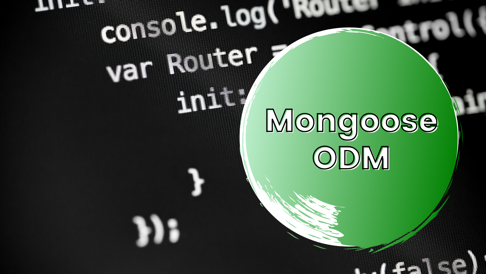

# Node Mongoose ODM (modular CRUD) 🚀🚀🚀

This guide looks at making CRUD operations using the [Mongoose ODM](https://mongoosejs.com/). 



The Mongoose methods highlighted are:

```
CREATE:
.save()
.create()
.insertMany()

READ:
.find()

UPDATE:
.updateOne()

DELETE:
.deleteOne()
```

The whole application is modularized so as to keep the code D.R.Y.

- The ```configs``` folder now holds all the logic mongoose connection and disconnection.
- The ```models``` folder now holds all the logic for the model generated by mongoose. 
- The ```queries``` folder now holds all the logic for the mongoose queries/methods 
- The ```app.js``` brings all the modular code together

## Getting Started 🏁

These instructions will help you get started with this project.

### Installing

Run:

```
npm install
```

This should retrieve all the necessary dependencies named in the `package.json` file.

### How To Use:

Once dependencies are installed, navigate to the ```app.js``` file and uncomment any of the functions you want to run.

Once that is done, the project can be run using:

```
npm start
```
